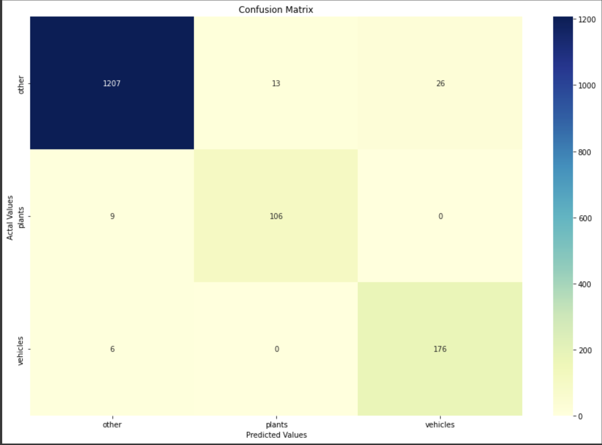
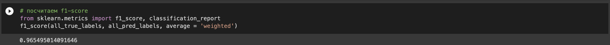
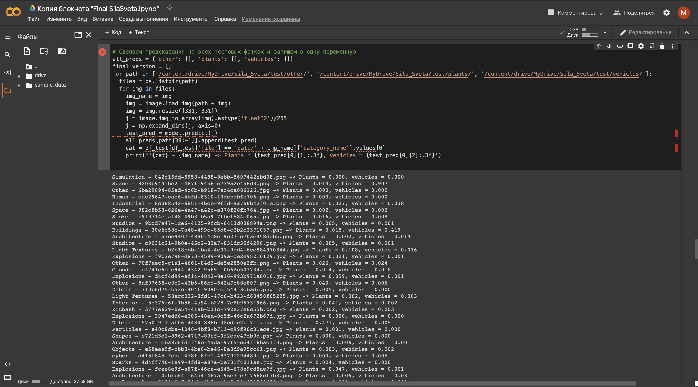

# SilaSveta
Image classification on a dataset with 3000 photos

## Задача
Дано: датасет из 3000 разных фотографий и файл json, описывающий их. 
Нужно построить модель, которая будет определять машины и растения на фотографиях. 

## Решение
 - Обрабатываем json фаил, чтобы понять какие есть фотографии. Разбиваем датасет на 3 класса: vehicles, plants, other(все другое) и делим на train/test.
 - Несбалансированность классов решаем с помощью аугментации классов vehicles, plants и наивного андерсемплинга класса other.
 - Используем fine-tuning на предобученной модели ResNetV102. Сохраняем новую модель
 - Делаем предикт на тестовой части.
 - Строим confusion matrix и считаем f1-score.
 
 
 
 
 

 
Чтобы код заработал, нужно подгрузить на свой гугл драйв датасет и файл json, и веса модели (https://drive.google.com/drive/folders/1UyyopmxWmEhlcJzH2xy5rGDhl-vWQ1Kv?usp=sharing), а затем подключить драйв к коллабу.

